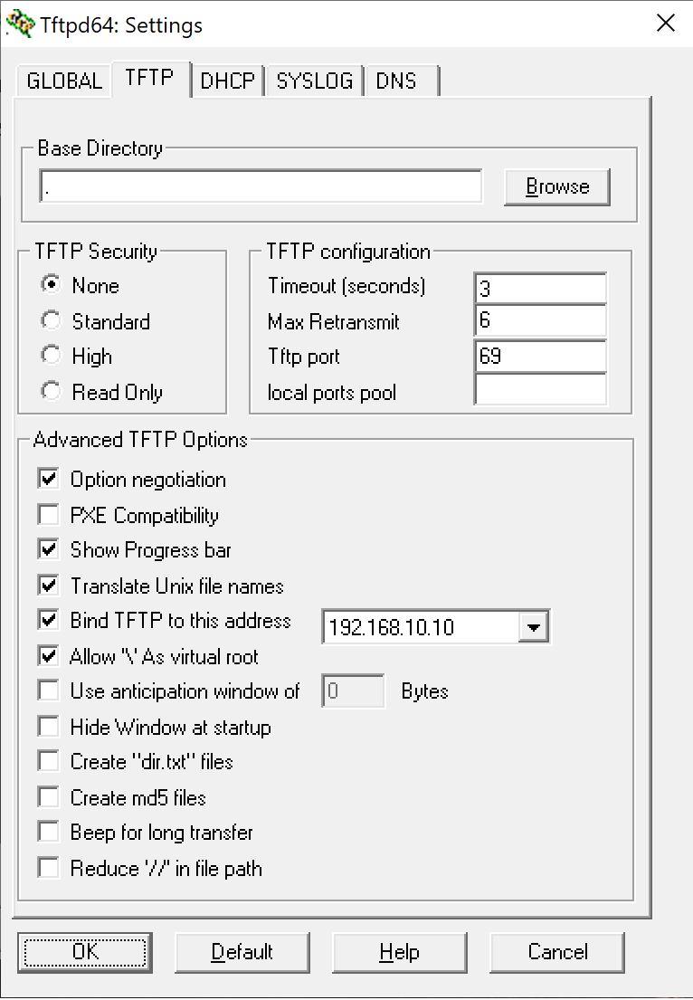

# Root Technicolor TG799VAC-Xtream Telenor

HOWTO Root Telenor TG799VAC Xtream > 18.1

## Under development!

## Start

In order to root Telenor we have to transfer an old rootable firmware. 

## Setup TFTP

First download TFTP in order to transfer rootable firmware.
Download https://bitbucket.org/phjounin/tftpd64/downloads/Tftpd64-4.64-setup.exe

RBI: 
Put the RBI in root folder of TFTP

Run it as Admininstrator! Make changes as shown in pictures. TFTP can be a pain sometimes. 

1. Have the router switched off.
1. Put an ethernet cable in ETH1 on the router
1. Take a paperclip or something small and push in the reset button. Turn on the router and wait until ETH led starts blinking and power light is Orange.
1. If everything done right TFTP should now transfer the RBI to the router.
1. Let the router boot up and login on webpage and se if you have version **17.1**
    1. If you have continue
    1. If not we have to switch loaded bank.

## Change booted bank!

This is how i change banks.
Take your cellphone or something with an timer.
1. Turn on the router and start the timer (30secs). 
2. After 30 secs push the power button fast(off, on) If done right all lights should lit up. Otherwise the time could be wrong.
3. Reset timer and wait 30 seconds more then fast (off, on) again. Leds lit up.
4. 30 secs again fast (off,on) then let the router boot. Now you should have **17.1**  booted.